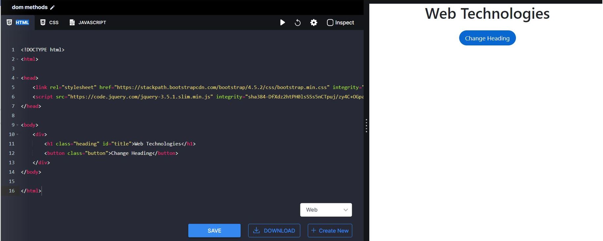
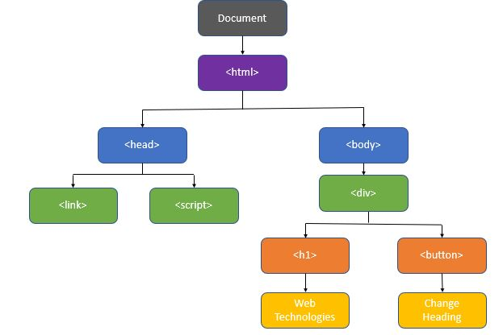
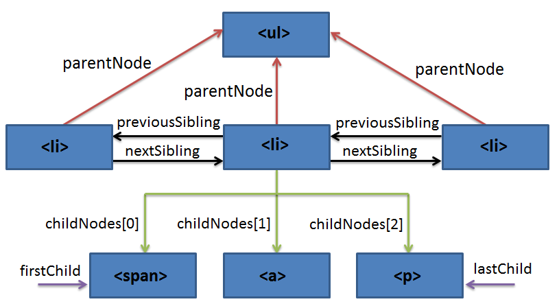

> # **DOM? How does it help? How to acess it? What are JS DOM Helper methods?**

> ### **_ABSTRACT_**  
**In recent years adding HTML elements dynamically using JS or React Js enables the creation of innovative Web applications with emergent features. DOM is a simple but effective way to achieve dynamic and responsive web pages and applications. DOM is used to manipulate the HTML document that allows programs and scripts to dynamically access and update the content, structure, and style of documents.**
<br/>

> ### **_INTRODUCTION_**
The DOM (Document Object Model) is an interface that represents how our HTML and XML documents are read by the browser. It allows JavaScript to manipulate, structure, and style our website. After the browser reads our HTML document, it creates a representational tree called the Document Object Model and defines how that tree can be accessed. It is the root element that represents the HTML document. It has properties and methods. With the help of document objects, we can add dynamic content to our web page.

<br/>

<p align="center">
  
</p>
                      <p align="center"><i>a.Sample HTML code</i></p>
<br/>


> ### **_HTML DOM Tree_**
<br/>
The DOM tree representation of the above code is shown below


<br/>
<br/>
<p align="center">
  
</p>
 <p align="center"><i>b.Sample DOM tree</i></p>


The DOM tree represents an HTML document as a node. Each node id referred to as an object.

<br/>
<br/>

> ### **_How Does It helps ???_**
With the Document Object Model, programmers can create and build documents, navigate their structure, and add, modify, or delete elements and content. Anything found in an HTML or XML document can be accessed, changed, deleted, or added using the Document Object Model.
<br/>
* We can change all the HTML elements and attributes in the page
* We can change all the CSS styles in the page
* We can remove existing HTML elements and attributes
* We can add new HTML elements and attributes
* We can react to all existing HTML events in the page
* We can create new HTML events in the page
<br/>


> ### **_How to access it?_**

The elements in DOM can be accessed by Javascript using the Document method and traverse method.

### **Document Method**

In the document method, we can access an element by using the following methods
<br/>
* getElementById(id)
* getElementsByClassName(className)
* getElementsByTagName(tagName)
* querySelector(cssSelector)
* querySelectorAll(cssSelector)
<br/>

### <u>**getElementById(id)**</u>
The Document method getElementById() returns an Element object representing the element whose id attribute matches the specified string. 
As the id attribute of the element is unique in an HTML document so we can use this method to select a specific element.
<br/>
Syntax :
```js
let element = document.getElementById(idOfelement) 
 ```
 
### <u>**querySelector(cssSelector)**</u>
The Document method querySelector() selects the element that matches the given string of selector or group of selectors. If more than one element has specified selectors it returns only the first element that matches the selectors.
<br/>
Syntax :
```js
let element = document.querySelector(selector) 
```

### <u>**getElementsByTagName(tagName)**</u>
The Document method getElementByTagName() returns a HTML collection of elements with a tag name mentioned. Unlike the getElementById() and querySelector() it gives a collection or list of the matching elements if one or more elements are with same tag name.
<br/>
Syntax:
```js
let elementsList = document.getElementByTagName(tagName) 
```

### <u>**getElementsByClassName(className)**</u>
The getElementsByClassName method of the Document interface returns an array-like object of all child elements of the parent element which have the given class name or class names. 
<br/>
Syntax :
``` js
let elementsList = document.getElementByClassName(className) 
```

### <u>**querySelectorAll(cssSelector)**</u>
The Document method querySelectorAll() returns a static (not live) NodeList representing a list of the document's elements that match the specified group of selectors. 
<br/>
Syntax:
```js
let elementList = document.querySelectorAll(selectors)
```

### **Traversing the DOM** 
<br/>
Another way to access elements is to "traverse" the DOM tree. In the traverse method, the DOM tree is imagined as a collection of elements related to each other through parent-child and sibling-sibling relationships. The element is identified or selected by its relationship with an already referenced existing node. 
<br/>
by using the following methods we can traverse back and forth through the DOM tree
<br/>
* firstElementChild
* lastElementChild
* nextElementChild/nextElementSibling
* previousElementChild/previousElementSibling
* childNodes / childElements
* childElementCount
<br/>

<p align="center">
  
</p>
                      <p align="center" style="Italic">
                      <i>Representaion of relationship between elements</i></p>
<br/>

> ### **_DOM helper methods_**
<br/>
DOM Helper is a npm module that has various DOM methods which are useful to create, edit, remove HTML elements, events, attributes Dynamically in javascript. By using these methods we can avoid redundancy of code and improve scalability.

Here are the most used DOM -helper methods :
<br/>
* addClass(element, className) -> This method used to add a class to the element

* removeClass(element, className) ->This method used to remove a class from elament

* hasClass(element, className) -> Return a Boolean value 

* toggleClass(element, className) ->  Adds a class if a xlass is not present removes the class if it ias already prensent

* addEventListener(node, eventName, handler, [options]) -> used to add event Liustener

* removeEventListener(node, eventName, handler, [options]) ->used to remove event Listener

* matches(element, selector) ->  used to check if the element would be selected by the provided selector string.

* filter(selector, fn): returns a function handler that only fires when the target matches or is contained in the selector.
<br/>

> ### **_Conclusion_**
The purpose of this Technical paper was to understand DOM and its advantages. Based on the analysis conveyed, it can be concluded that there are multiple DOM methods to access elements and modify, add or delete dynamically in web applications.  I have tried to cover a maximum of them with examples & simple explanations. 
<br/>

> ### **_References_**


1. https://developer.mozilla.org/en-US/docs/Web/API/Document_Object_Model/Introduction

2. https://www.researchgate.net/figure/Example-of-DOM-Node-Tree_fig1_254002847

3. https://www.javatpoint.com/document-object-model#

4. https://www.w3.org/TR/WD-DOM/introduction.html

5. https://www.javatpoint.com/document-object-model#


6. https://www.qualitestgroup.com/resources/knowledge-center/how-to-guide/traverse-dom/
